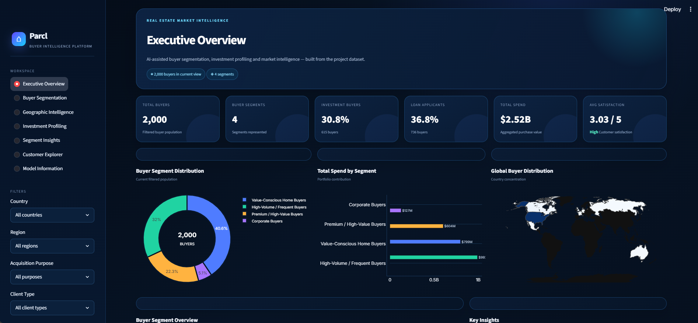

# 🏢 Real Estate Buyer Segmentation & Investment Intelligence

**An end-to-end machine learning and market-intelligence solution for buyer segmentation, investment profiling, and decision-ready analytics.**

[](LICENSE)
[](https://www.python.org/)
[](https://streamlit.io/)

**Client:** Parcl Co. Limited | **Program:** Unified Mentor

---

## 📸 Dashboard Preview

The dashboard uses a premium executive interface with 7 analytical pages and fully interactive filters:



*Executive Overview page: interactive KPIs (2,000 buyers, 4 segments, $2.52B total spend), a segment-distribution donut chart, a spend-by-segment bar chart, and a country-concentration world map — all updated dynamically by the sidebar filters (Country, Region, Acquisition Purpose, Client Type). The Geographic Intelligence page also provides a regional concentration bar chart because the dataset contains 57 mixed-country sub-regions that are not directly comparable on a single global map.*

---

## 🎯 The Business Problem

Real estate buyers are highly diverse — individual home buyers, institutional investors, international buyers, high-net-worth investors, first-time buyers. Without segmentation, a company markets to all of them the same way, leading to:
- Inefficient marketing spend
- Generic property recommendations
- Poor investor targeting

This project uses **unsupervised machine learning** to discover the buyer segments that genuinely exist in Parcl's data — not the ones assumed in advance — and turns them into an actionable, evidence-based targeting framework.

---

## ✨ What Makes This Project Different

| Most student ML projects | This project |
|---|---|
| Force data into pre-assumed categories | Segments named from what the data *actually* shows |
| Report one silhouette score and move on | Cross-validated with Hierarchical clustering + 6-seed stability + 10x bootstrap resampling |
| Hide weak results | Openly discloses modest silhouette (0.12–0.15) and *why* |
| Static charts in a notebook | Live, interactive Streamlit dashboard with real filters |
| "I ran K-Means" | The brief's own suggested method was implemented and tested directly — and rejected with data, not assumption |

---

## 🧩 The Four Segments (Data-Derived, Not Assumed)

| Segment | Size | Defining Trait | Recommended Action |
|---|---|---|---|
| 🔵 **Value-Conscious Home Buyers** | 812 (41%) | Lowest spend/price among individuals | Affordability messaging, starter financing |
| 🟢 **High-Volume / Frequent Buyers** | 640 (32%) | Highest purchase frequency | Loyalty incentives, early access to listings |
| 🟠 **Premium / High-Value Buyers** | 446 (22%) | Highest average purchase price | Exclusivity, white-glove service |
| 🟣 **Corporate Buyers** | 102 (5%) | Company clients | Dedicated B2B sales motion |

---

## 🏷️ Professional File Naming

All deliverables use numbered, descriptive names so an evaluator can understand the project flow immediately: **01 = data preparation, 02 = EDA, 03 = clustering, 04 = validation, 05 = brief-method validation**. Output figures and tables follow the same numbered convention.

## 🗂️ Project Structure

```
Real-Estate-Buyer-Segmentation-and-Investment-Intelligence/
├── data/
│   ├── raw/                  # Original, untouched: Client_Master_Raw_Data.csv, Property_Transactions_Raw_Data.csv
│   └── processed/            # Cleaned + merged output (generated by 01_Data_Preprocessing.py)
├── src/
│   ├── 01_Data_Preprocessing.py      # Cleans data, merges clients+properties, engineers features
│   ├── 02_Exploratory_Data_Analysis.py                 # Generates 9 exploratory charts
│   ├── 03_Buyer_Segmentation_Clustering.py          # K-Means + Hierarchical clustering, saves the model
│   ├── 04_Model_Robustness_Validation.py    # Seed stability, bootstrap resampling, feature correlation
│   └── 05_Brief_Encoding_Validation.py   # Tests the brief's literal encoding method directly
├── app/
│   └── Real_Estate_Buyer_Intelligence_Dashboard.py                 # The Streamlit dashboard (7 pages)
├── models/                    # Trained model, scaler, metadata (generated)
├── outputs/
│   ├── figures/                # 13 charts (generated)
│   └── tables/                 # 11 result tables/JSON (generated)
├── notebooks/
│   └── End_to_End_Buyer_Segmentation_Walkthrough.ipynb   # Full pipeline, actually executed
├── tests/
│   ├── 01_Dashboard_Logic_Tests.py      # Automated dashboard/data logic tests
│   ├── Run_Offline_Tests.py         # Backup runner if pytest isn't installed
│   └── stubs/                  # Lightweight test doubles (never touch these)
├── docs/
│   ├── 01_Executive_Summary.docx  # 2-page summary
│   ├── 02_Research_Paper.docx     # Full 11-page paper
│   ├── 03_Executive_Presentation.pptx       # 12-slide deck
│   └── *.md                    # Methodology, robustness, data dictionary docs
├── LICENSE
├── README.md
└── requirements.txt
```

---

## 🚀 How to Run — Step by Step

### 1. Install dependencies
```bash
pip install -r requirements.txt
```

### 2. Run the pipeline — in this exact order
```bash
python src/01_Data_Preprocessing.py
python src/03_Buyer_Segmentation_Clustering.py
python src/02_Exploratory_Data_Analysis.py
python src/04_Model_Robustness_Validation.py
python src/05_Brief_Encoding_Validation.py
```

### 3. Run the tests
```bash
pip install pytest
pytest tests/01_Dashboard_Logic_Tests.py -v
```
Expected: **5 passed**.

### 4. Launch the dashboard
```bash
streamlit run app/Real_Estate_Buyer_Intelligence_Dashboard.py
```
Opens at `http://localhost:8501`. **Always use `streamlit run`, never `python Real_Estate_Buyer_Intelligence_Dashboard.py` directly** — Streamlit apps require its own runtime to render; running them as a plain script produces harmless-looking `missing ScriptRunContext` warnings and no actual UI.

---

## 🛠️ Troubleshooting (Real Issues Seen During Testing)

### `AttributeError: module 'matplotlib' has no attribute 'use'`
This means your local `matplotlib` install is broken — usually from a `pip install` that got interrupted partway (commonly by an antivirus or another Python process locking a file mid-upgrade on Windows: `OSError: [WinError 32] The process cannot access the file...`). Fix:
```bash
pip uninstall matplotlib -y
pip install matplotlib==3.10.8
```
If the uninstall itself fails with a "file in use" error, close every Python process, IDE, and Jupyter kernel first (they hold matplotlib's font files open), then retry. As a last resort: `pip install --user matplotlib==3.10.8`.

### `pip install -r requirements.txt` fails with `WinError 32` mid-upgrade
Same root cause as above — something (often Anaconda's own environment, or a running Jupyter/Spyder session) has a package file open. Close all other Python-related programs and terminals, then re-run the install in a fresh terminal.

### `Please replace 'use_container_width' with 'width'` warning
Already fixed in this version of `Real_Estate_Buyer_Intelligence_Dashboard.py` — if you still see it, you're running an older copy of the file.

### `UnicodeDecodeError: 'charmap' codec can't decode byte...` when running the tests
This was a real bug, now fixed: the test file previously read `Real_Estate_Buyer_Intelligence_Dashboard.py` without specifying UTF-8 encoding, which broke on Windows (whose default encoding is `cp1252`, not UTF-8) since the app contains special characters like em-dashes. If you have an older copy of `tests/01_Dashboard_Logic_Tests.py`, re-download it.

### Dashboard shows old/stale numbers
The dashboard reads from `data/processed/Buyer_Segmentation_Results.csv` and `models/`, which are pre-generated and shipped in this repo. If you've changed the source data, re-run the full pipeline (Step 2 above) to regenerate them before relaunching Streamlit.

---

## 🔬 Methodology Summary

1. **Data audit**: 2,000 clients, 10,000 property transactions — discovered a critical one-client-to-many-properties relationship that a naive merge would have corrupted.
2. **Cleaning**: mixed date formats, currency strings, categorical normalization.
3. **Feature engineering**: total spend, purchase frequency, unit mix, loan/investment/company flags.
4. **Clustering**: K-Means (k=2–10) evaluated via Elbow Method + Silhouette Score, cross-validated against Hierarchical clustering.
5. **k=4 selected** — not the silhouette-optimal k=3 — because it isolates Corporate Buyers as an operationally distinct segment. This trade-off is disclosed, not hidden.
6. **Robustness testing**: 6 random seeds (revealed bimodal convergence — two distinct stable solutions), 10x 80% bootstrap resamples, feature-correlation audit.
7. **Brief-compliance test**: the original brief's own suggested encoding method (One-Hot/Label Encoding of categorical fields) was implemented literally and tested — its raw silhouette scores higher but produces degenerate, meaningless clusters (one exactly reproduces the `client_type` column). Full detail in `docs/07_Brief_Encoding_Comparison.md`.

---

## 📊 Key Numbers

| Metric | Value |
|---|---|
| Clients analyzed | 2,000 |
| Property transactions | 10,000 |
| Final k | 4 |
| Silhouette score | 0.1405 |
| ARI vs. Hierarchical clustering | 0.267 |
| Dashboard pages | 7 |

---

## ⚠️ Honest Limitations

- Silhouette scores are modest (0.12–0.15): buyer behavior varies continuously, not in sharp groups.
- Seed stability is bimodal — a different arbitrary random seed could plausibly ship a qualitatively different clustering.
- The client base is 76.9% USA; country-level comparisons for small countries (e.g. Denmark, n=15) are statistically noisy.
- Five of nine clustering features are highly intercorrelated around "transaction scale," which shapes what separates the segments.
- No marketing-response/campaign-cost data exists to validate the business recommendations' ROI directly.

These are stated plainly in the research paper and the dashboard's Model Information page — not hidden to make the results look stronger than they are.

---

## 🗺️ Geographic Analysis Note

The project brief asks for geographic buyer analysis and region-level filtering. The dashboard implements this in two complementary ways: **country-level choropleth mapping** for globally comparable locations, plus a **regional concentration bar chart** for the 57 sub-regions/states/provinces in the dataset. Region is intentionally kept out of the clustering feature matrix because its high cardinality and mixed-country meaning would distort distance-based clustering.

## 🔮 Future Scope

- Test Gaussian Mixture Models or DBSCAN as alternatives to K-Means's hard spherical-cluster assumption.
- Incorporate marketing-response data to validate segment-specific campaign recommendations directly.
- Add time-series purchase-recency/frequency trends as more transaction history accumulates.
- Reduce multicollinearity by combining or dropping `n_towers`/`total_purchases` and `avg_floor_area`/`avg_purchase_price`.

---

## 🛠️ Tech Stack

Python · Pandas · NumPy · Scikit-learn · SciPy · Matplotlib · Plotly · Streamlit · Joblib · Pytest

---

## 📄 License

This project's code is released under the [MIT License](LICENSE) — **edit the copyright line in `LICENSE` to your own name before publishing.** The dataset (`data/raw/Client_Master_Raw_Data.csv`, `data/raw/Property_Transactions_Raw_Data.csv`) was supplied by Unified Mentor/Parcl Co. Limited for this project brief and is not original data covered by this license.

---

## 🙋 Interview One-Liner

*"I built an end-to-end ML pipeline that discovers real buyer segments from transaction data rather than assuming them, validated the clustering three independent ways, stress-tested it against random-seed and resampling variation, directly tested the original brief's own suggested method to show why my approach is more defensible, and shipped it as a live interactive dashboard — with every limitation disclosed up front."*
